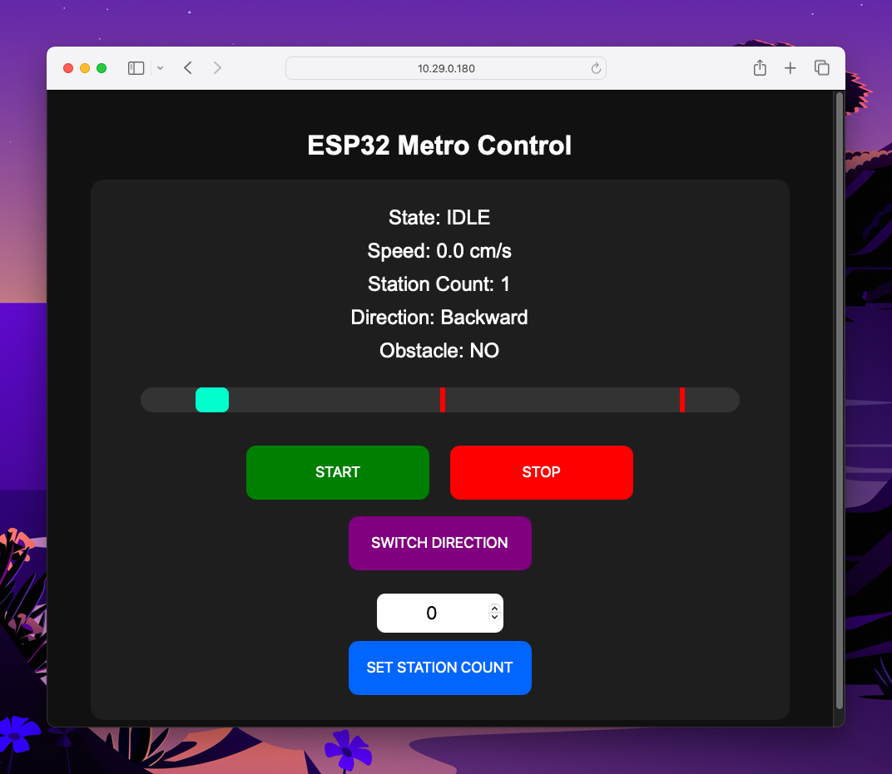

# Mini Metro – ESP32 Project

Mini Metro is an ESP32-based Arduino project developed for the university course **"How to Make Almost Anything"**, Spring 2026 at the IT University of Copenhagen.

The project simulates a small autonomous metro system with station detection, obstacle avoidance, automatic doors, direction switching, speed tracking, and a live web-based control platform hosted directly from the ESP32.

## Features

- Web-based metro control dashboard
- Automatic station detection using a hall effect sensor
- Obstacle detection with IR sensors
- Servo-controlled metro doors
- Bidirectional DC motor movement
- OLED live status display
- RGB LED status indicators
- Real-time speed estimation

## Purpose

The project was created as an exploration of embedded systems, physical computing, sensors, and interactive transportation systems using Arduino and ESP32 technologies.

## Authors

Created by Tómas Elí Stefánsson & Jacob Møller Jensen
